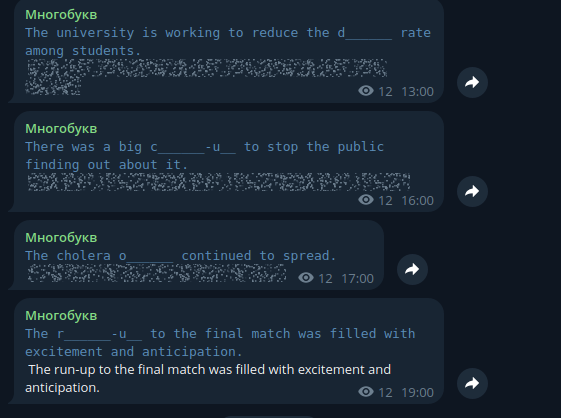

### English Phrases Bot
This educational utility allows sending gapped sentences to a Telegram channel.



### Setup

- Create a private GitHub repository that will serve as a database for the bot.  
- Create a Telegram bot that will send phrases to the channel.  
- Create a Telegram channel.  
- Fill `source.txt` with desired phrases. Copy and paste them into `current_dict.txt`.  

#### In `config.py`  

Set up the following variables:  
- `GITHUB_REPO_NAME`, `GITHUB_REPO_ACCESS_TOKEN`, `TGBOT_TOKEN`, `TG_CHAT_ID`.  

Set up file paths:  
- `ENPH_SOURCE_DICT_PATH` – Path to the source dictionary (`source.txt`).  
- `ENPH_CURRENT_DICT_PATH` – Path to the current dictionary (`current_dict.txt`). When the bot sends a new phrase to the channel, this phrase is removed from this file and added to `used_word_list.txt`.  
- `ENPH_USED_DICT_LIST_PATH` – Path to the file containing phrases that have already been sent (`used_word_list.txt`).  

### How to Run  

Build the container:  
```bash
sudo docker build -t wordeli .
```
Run it:  
```bash
sudo docker run wordeli
```
